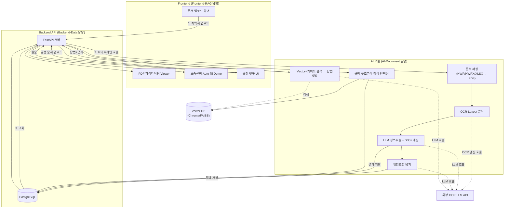
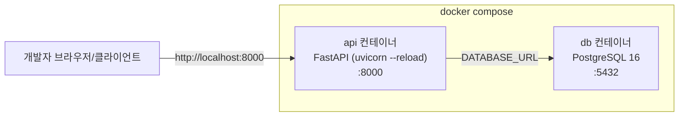
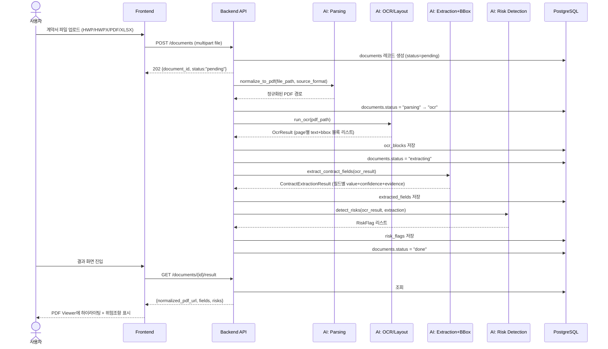
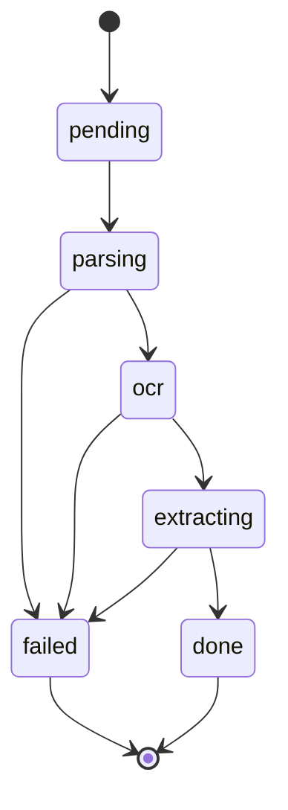
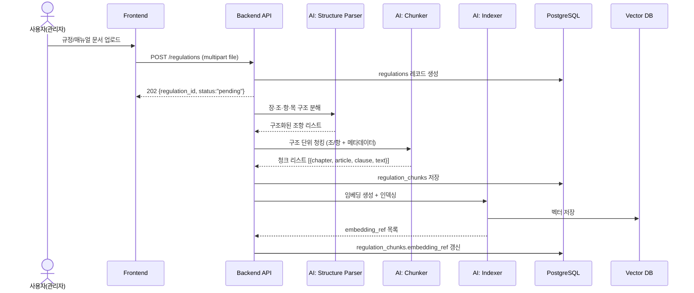
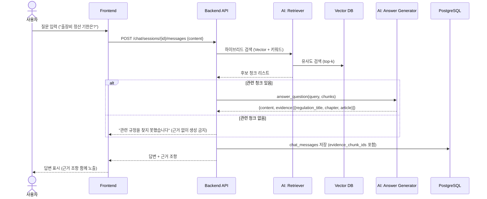
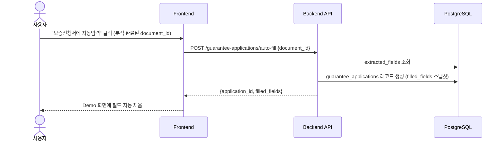

# ClausePilot

AI를 활용하여 계약을 검토하고 위험조항을 판단하여 안내하고 안전한 계약을 지원하는 AI 솔루션 서비스입니다.

## 목차

- [시스템 아키텍처 설계서](#시스템-아키텍처-설계서)
- [전체 데이터 흐름 정의서](#전체-데이터-흐름-정의서)

---

# 시스템 아키텍처 설계서

AI 기반 계약서 검증 및 규정 챗봇 시스템 — 설계 단계 산출물

## 1. 문서 목적 및 범위

이 문서는 팀 전체(AI·Document / Backend·Data / Frontend·RAG)가 공유하는 **시스템 수준** 아키텍처를 정의한다.
각 파트의 세부 설계는 아래 문서를 함께 참고한다.

- Backend 상세 설계: [`feat/back` 브랜치의 `backend/docs/`](https://github.com/Trivance-A/ClausePilot/tree/feat/back/backend/docs) (DB ERD, API 명세, AI 연동 인터페이스, 기술스택)
- AI·Document 상세 설계: 별도 진행 예정 (본 문서의 파이프라인 정의를 기준으로 삼음)
- Frontend·RAG 상세 설계: 별도 진행 예정

## 2. 시스템 개요

프로젝트명: **AI 기반 계약서 검증 및 규정 챗봇 시스템**

시스템은 독립적인 두 파이프라인으로 구성된다.

| 파이프라인 | 목적 | 핵심 산출 기능 |
|---|---|---|
| 계약서 분석 파이프라인 | 계약서에서 주요정보를 자동 추출하고 원문 위치·위험조항을 함께 제공 | PDF 하이라이팅 Viewer, 위험조항 탐지, 보증신청 Auto-fill Demo |
| 규정 챗봇(RAG) 파이프라인 | 사내 규정/매뉴얼을 자연어로 질의·응답 | 근거 조항 기반 RAG 챗봇 |

## 3. 전체 아키텍처 다이어그램

## 4. 컴포넌트 책임 정의

| 컴포넌트 | 담당 | 책임 | 기술(안) |
|---|---|---|---|
| Frontend | Frontend·RAG | 업로드 UI, PDF 하이라이팅 Viewer, Auto-fill Demo 화면, 챗봇 UI | 5주차 확정 |
| Backend API | Backend·Data | 요청 오케스트레이션, DB 저장/조회, AI 모듈 호출, 상태 관리 | FastAPI + PostgreSQL |
| AI 모듈 | AI·Document | 문서 파싱, OCR/Layout, 정보추출, BBox 매핑, 위험조항 탐지, RAG(청킹/검색/답변) | Python, 외부 OCR/LLM API |
| Vector DB | AI·Document (Backend와 연동) | 규정 청크 임베딩 저장 및 유사도 검색 | Chroma 또는 FAISS |
| 외부 OCR/LLM API | - | OCR, 정보추출/위험판단/답변생성에 사용되는 AI 모델 호출 | 5주차 벤더 확정 |

Backend와 AI 모듈 간 정확한 호출 인터페이스(함수 시그니처)는 [`feat/back` 브랜치의 `backend/docs/04_ai_integration.md`](https://github.com/Trivance-A/ClausePilot/blob/feat/back/backend/docs/04_ai_integration.md) 참고.

## 5. 배포/실행 구조 (개발 환경)

- 실행: `cd backend && make up` (Docker Compose로 api+db 동시 기동)
- 테스트: `cd backend && pytest` (DB 없이도 라우트/모델 정합성 검증)
- 상세: [`feat/back` 브랜치의 `backend/README.md`](https://github.com/Trivance-A/ClausePilot/blob/feat/back/backend/README.md)

## 6. 학기 프로젝트 범위 조정

| 원 RFP 요구사항 | 조정 내용 | 사유 |
|---|---|---|
| EBIZ/KOINS 실시스템 연동 | 별도 Demo UI(Auto-fill)로 대체 | 외부 시스템 접근 권한 없음 |
| 수기체(손글씨) OCR | 제외, 인쇄체 문서 중심 | 학기 프로젝트 범위 |
| 대규모 Graph DB/Ontology | 경량 Vector+키워드 검색으로 대체 | 팀 규모(3인) 대비 과도한 복잡도 |

## 7. 성능 목표와 아키텍처의 연결

| 목표 | 아키텍처 상 반영 지점 |
|---|---|
| 정보추출 정확도 90%+ | Extraction 단계 (LLM 프롬프트 + 후처리 정규화) |
| BBox 매핑 성공률 95%+ | Extraction → BBox 매핑 단계, `extracted_fields.evidence_*` 컬럼 |
| 규정검색 Recall@5 90%+ | RAG 검색 단계 (Vector+키워드 하이브리드) |
| 근거없는 챗봇 응답 5% 이하 | RAG 답변생성 단계 — 근거 chunk 없으면 미생성 원칙 |
| 주요기능 정상동작률 95%+ | Backend의 단계별 상태 추적(`documents.status`) 및 실패 격리 설계 |

## 8. 다음 단계 (5주차)

- Frontend 아키텍처 상세화 (화면-API 매핑)
- AI 모듈 내부 설계 문서 작성 (본 문서의 파이프라인을 기준으로 구체화)
- 컴포넌트 간 인터페이스(AI↔Backend, Backend↔Frontend) 최종 합의

---

# 전체 데이터 흐름 정의서

AI 기반 계약서 검증 및 규정 챗봇 시스템 — 설계 단계 산출물

## 1. 문서 목적

시스템 내 데이터가 어떤 형태로 생성·변환·저장되는지 단계별로 정의한다. [시스템 아키텍처 설계서](#시스템-아키텍처-설계서)가
"어떤 컴포넌트가 있는가"를 정의한다면, 본 문서는 **"데이터가 각 단계를 거치며 어떤 모습으로 바뀌는가"**를 정의한다.

## 2. 흐름 A — 계약서 분석 파이프라인

### 2.1 시퀀스

### 2.2 단계별 데이터 형태

| 단계 | 입력 | 출력 | 저장 테이블 |
|---|---|---|---|
| 업로드 | 원본 파일 (hwp/hwpx/pdf/xlsx) | `documents` 레코드 (status=pending) | `documents` |
| 파싱(정규화) | 원본 파일 경로 + 포맷 | 정규화된 PDF 경로, 페이지 수 | `documents.normalized_pdf_path` |
| OCR/Layout | 정규화 PDF | 페이지별 텍스트 블록 리스트 `[{block_id, text, bbox, type, confidence}]` | `ocr_blocks` |
| 정보추출 | OCR 블록 리스트 | 필드별 `{value, confidence, evidence:{page_no,block_id,bbox}}` | `extracted_fields` |
| 위험조항 탐지 | OCR 블록 + 추출결과 | `{category, level, description, evidence}` 리스트 | `risk_flags` |
| 결과 조회 | document_id | PDF URL + fields + risks 통합 JSON | (조회 전용, 신규 저장 없음) |

필드 스키마 상세: [`feat/back` 브랜치의 `backend/docs/04_ai_integration.md`](https://github.com/Trivance-A/ClausePilot/blob/feat/back/backend/docs/04_ai_integration.md), DB 컬럼: [`backend/docs/02_db_erd.md`](https://github.com/Trivance-A/ClausePilot/blob/feat/back/backend/docs/02_db_erd.md)

### 2.3 처리 상태 전이 (`documents.status`)

`failed` 전이 시 어느 단계에서 실패했는지(`parsing`/`ocr`/`extracting`)를 status에 남겨, 프론트에서
"어느 단계 실패인지"를 사용자에게 보여줄 수 있게 한다 (5주차: 실패 사유 필드 추가 여부 결정).

## 3. 흐름 B — 규정 챗봇(RAG) 인덱싱

## 4. 흐름 C — 규정 챗봇 질의응답

## 5. 흐름 D — 보증신청 Auto-fill Demo

## 6. 데이터 저장 지점 요약

| 저장 시점 | 테이블 | 핵심 필드 |
|---|---|---|
| 문서 업로드 직후 | `documents` | source_format, status, normalized_pdf_path |
| OCR 완료 후 | `ocr_blocks` | page_no, block_id, text, bbox, confidence |
| 정보추출 완료 후 | `extracted_fields` | field_key, value, confidence, evidence_bbox |
| 위험조항 탐지 완료 후 | `risk_flags` | category, level, description, evidence_bbox |
| 규정 인덱싱 완료 후 | `regulation_chunks` | chapter, article, clause, text, embedding_ref |
| 챗봇 응답 시 | `chat_messages` | role, content, evidence_chunk_ids |
| Auto-fill 실행 시 | `guarantee_applications` | filled_fields (JSON 스냅샷) |

테이블 전체 정의: [`feat/back` 브랜치의 `backend/docs/02_db_erd.md`](https://github.com/Trivance-A/ClausePilot/blob/feat/back/backend/docs/02_db_erd.md)

## 7. 설계 원칙 재확인

- 모든 AI 산출물(정보추출, 위험조항, 챗봇 답변)은 **원문 근거(evidence)를 동반**해야 DB에 저장할 수 있다 — evidence 없는 값은 `null`로 명시.
- 장시간 처리(OCR/LLM 호출)는 **동기 응답이 아닌 상태 폴링 방식**으로 설계되어, Frontend가 진행 상황을 표시할 수 있다.
- RAG는 **근거 청크가 없으면 답변을 생성하지 않는다** — 근거 없는 응답 5% 이하 목표와 직결되는 흐름상의 분기점(흐름 C의 `alt`).

## 8. 진행 예정 작업

- 실패(`failed`) 상태의 세부 사유 필드 추가 여부
- OCR 처리 시간이 길 경우 프론트 폴링 주기(초 단위) 확정
- RAG 검색 top-k, 재랭킹 적용 여부에 따른 흐름 C 세부 조정
